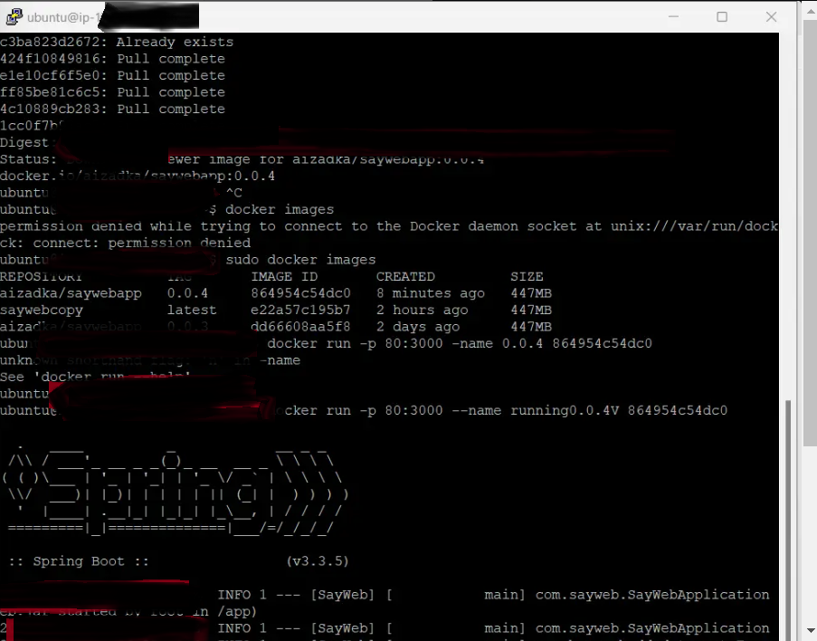
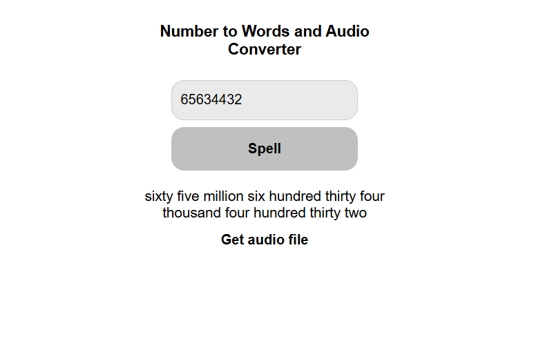
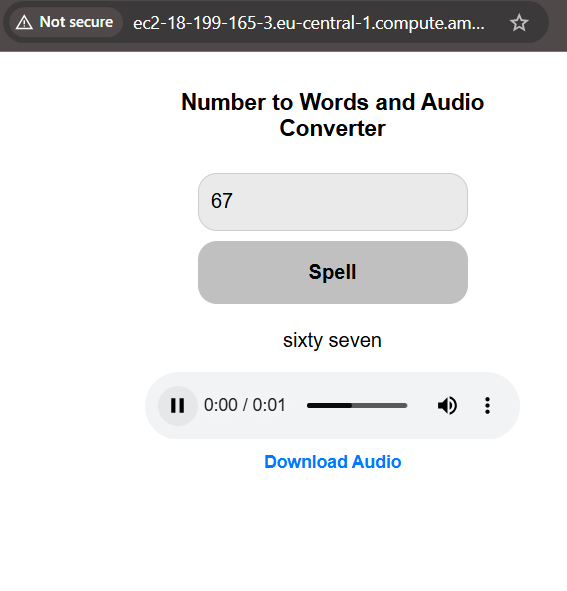
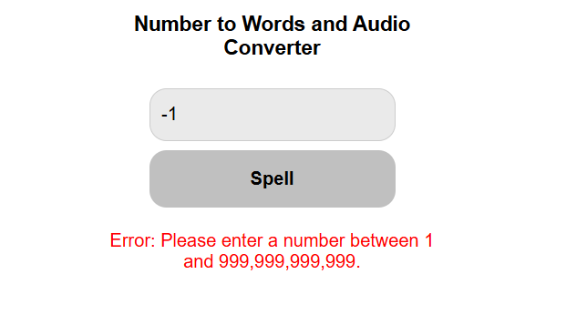
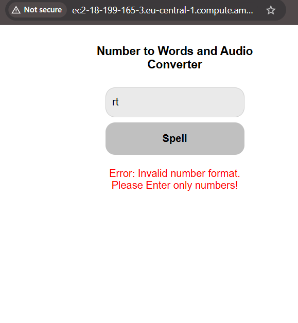

# **About**<br>
Given a number from 0 to 999,999,999,999, spell out that number in English.

**Step 1**<br>
Handle the basic case of 0 through 99.
If the input to the program is 22, then the output should be 'twenty-two'.
Your program should complain loudly if given a number outside the blessed range. 

**Step 2**<br>
Implement breaking up a number into chunks of thousands... Then handle inserting the appropriate scale word between those chunks.
So 1234567890 should yield '1 billion 234 million 567 thousand 890'

**Step 3**<br>
Put it all together to get nothing but plain English. 12345 should give twelve thousand three hundred forty-five.

**Step 4**<br>
Write your project using Spring Boot as a web application and deployed to a cloud. On AWS, the web app should be accessible via a public URL from anywhere. 

```
The web app has a single page with the form, which contains an input field,
a button and a result text area (a div or a span).

`The workflow is the following`:
A user enters a number into to the input field.
A user clicks the button.
The form sends a request to the server to convert a given number to words.
The form gets a response from the server and shows a result in the result area.

`Validations`:
Check if a given number is valid (is a number) and within an acceptable range. 
Otherwise, show an error in the result area. 
This validation should be done on the server side (not on frontend or JavaScript).
```
### Source of task: [Exercism Java Exercise](https://exercism.org/tracks/java/exercises/say)

## **Used Technologies**<br>
- Java: **Version 17**<br>
- Spring Boot: **Version 3.3.5**<br>
- Maven: **Version 4.0.0**<br>
- Docker: **openjdk:17-jdk-slim image**<br>
- Espeak-ng: **1.52-dev**<br>
- AWS EC2 instance: **Ubuntu 24.04.1 LTS (Noble Numbat)**<br>

## Demo Screenshots






